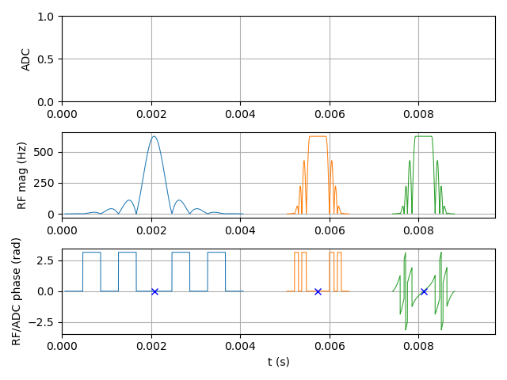
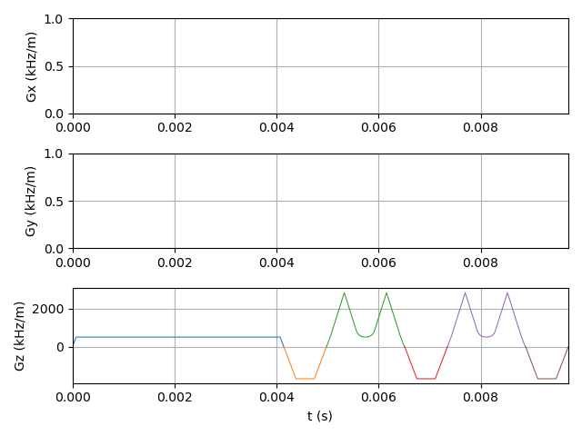
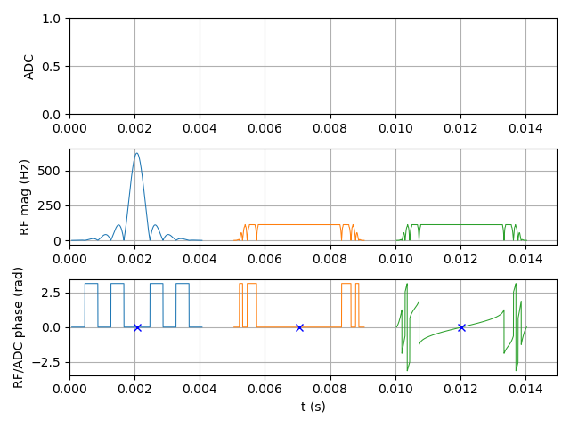
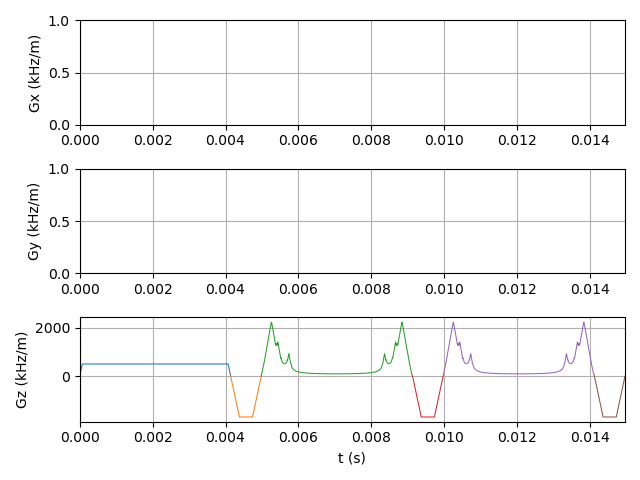

# VERSE

Variable-rate Selective Excitation (VERSE) algorithms and helpers in C, MATLAB, and Python, including **PyPulseq** integration.

## Simple usage with PyPulseq

```python
import pypulseq as pp
import pyverse_pulseq as ppverse # The pypulseq-compatible VERSE library
from math import pi

# Set limits
system = pp.Opts(max_grad=80, grad_unit="mT/m", max_slew=200, slew_unit="T/m/s")
seq = pp.Sequence(system)

# Generate high time-bandwidth product Sinc pulse
rf, gz, gzr = pp.make_sinc_pulse(
    flip_angle      = pi/2,
    apodization     = 0.5,
    slice_thickness = 5.0e-3,
    time_bw_product = 10,
    return_gz       = True
)

# Minimum time VERSE algorithm
rfv, gzv = ppverse.verse(rf, gz, type="mintime", system=system)

# Add non-linear phase ramp for slice-offset to RF waveform
rfv_offset = ppverse.apply_offcenter_phase(rfv, gzv, offset=1e-3, system=system)

# Build sequence and plot
seq.add_block(rf, gz)
seq.add_block(gzr)
seq.add_block(rfv, gzv)
seq.add_block(gzr)
seq.add_block(rfv_offset, gzv)
seq.add_block(gzr)
seq.plot(rf_plot='abs')
```
<table>
  <tr>
    <td align="left">
      <br>
    </td>
    <td align="right">
      <br>
    </td>
  </tr>
</table>

```python
# Minimum SAR (fixed-duration) VERSE algorithm
rfv, gzv = ppverse.verse(rf, gz, type="minsar", system=system)

# Add non-linear phase ramp for slice-offset to RF waveform
rfv_offset = ppverse.apply_offcenter_phase(rfv, gzv, offset=1e-3, system=system)

# Build sequence and plot
seq.add_block(rf, gz)
seq.add_block(gzr)
seq.add_block(rfv, gzv)
seq.add_block(gzr)
seq.add_block(rfv_offset, gzv)
seq.add_block(gzr)
seq.plot(rf_plot='abs')
```
<table>
  <tr>
    <td align="left">
      <br>
    </td>
    <td align="right">
      <br>
    </td>
  </tr>
</table>

## Features
- Minimum-time VERSE (mintverse)
- Minimum-SAR VERSE (minsarverse; fixed duration)
- Core C implementation for multi-language usage
- MATLAB:
  - Pure MATLAB implementations: `mintverse.m`, `minsarverse.m`
  - MEX wrappers around the C library: `mintverse_c.m`, `minsarverse_c.m`
- Python:
  - ctypes wrapper around the C library: `pyverse_c.py`
  - pypulseq helpers: `pyverse_pulseq.py`

## Installation

### Python
Install the package:
```bash
pip install .
```

Optionally build the C shared library used by the ctypes wrapper:
```bash
bash build_python_lib.sh
```
This produces:
- Linux: `python/libverse.so`
- macOS: `python/libverse.dylib`
- Windows (MSYS/Cygwin): `python/verse.dll`

### MATLAB
Pure MATLAB functions require no build:
- `matlab/mintverse.m`
- `matlab/minsarverse.m`

To build the C-accelerated MEX functions, run inside MATLAB from the repo root:
```matlab
build_matlab_mex
```
This compiles with the `-R2017b` MEX API and outputs:
- `matlab/mintverse_mex.<mexext>`
- `matlab/minsarverse_mex.<mexext>`

Wrappers `mintverse_c.m` and `minsarverse_c.m` call these MEX binaries.

If no compiler is configured, run:
```matlab
mex -setup C
```

## Usage: MATLAB

Pure MATLAB:
```matlab
[b1v, gv] = mintverse(b1, g, dt, bmax, gmax, smax); % minimum-time
[b1v, gv] = minsarverse(b1, g, dt, gmax, smax);     % minimum-SAR
```

Mexed C-code (after building MEX):
```matlab
[b1v, gv] = mintverse_c(b1, g, dt, bmax, gmax, smax);
[b1v, gv] = minsarverse_c(b1, g, dt, gmax, smax);
```

## Repository layout
- `c/` — C core (`verse.c`, `verse.h`)
- `matlab/` — MATLAB API (pure and MEX wrappers)
- `python/` — Python API (ctypes + pypulseq helpers)
- `build_python_lib.sh` — Build script for Python shared library
- `build_matlab_mex.m` — Build script for MATLAB MEX files
- `archive/` — Legacy/testing implementations

## Requirements
- C compiler (gcc/clang/MSVC)
- MATLAB R2018a+ recommended (MEX compiled with `-R2017b` API)
- Python 3.8+ (NumPy, SciPy, matplotlib, pypulseq)

## License
See `LICENSE`

## References

If you use the minimum-time VERSE algorithm in your work, please cite the following paper alongside this repository:

Hargreaves BA, Cunningham CH, Nishimura DG, Conolly SM. Variable-rate selective excitation for rapid MRI sequences. Magnetic Resonance in Medicine. 2004;52(3):3. doi:10.1002/mrm.20168

If you use the minimum-SAR VERSE algorithm in your work, please cite the following paper alongside this repository:

Woods JG, Ji Y, Li H, Hess AT, Okell TW. SNR-efficient whole-brain pseudo-continuous arterial spin labeling perfusion imaging at 7 T. Magnetic Resonance in Medicine. 2025;94(3):965-981. doi:10.1002/mrm.30527

## Links
- Source: https://github.com/JosephGWoods/VERSE
- Issues: https://github.com/JosephGWoods/VERSE/issues
